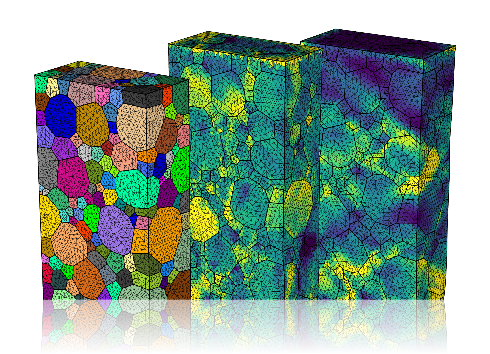

    

# FEPX: Finite Element Polycrystal Plasticity

FEPX is a finite element software package for polycrystal plasticity. It can model both the global and local mechanical behaviors of large polycrystalline aggregates with complex microstructures via a scalable parallel framework.

_See also FEPX's companion program, [Neper](https://neper.info), a polycrystal generation and meshing tool. Neper acts as the primary pre- and post processor for FEPX._

FEPX's primary features are:

### Nonlinear kinematics capable of resolving large (or finite) strains and large rotations

  Polycrystals can be deformed to small strains (elastic regime, elastic-plastic transition) or large strains, up to values of ~0.4, or even more with the aid of re-meshing (via Neper)

### Anisotropic elasticity based on crystal symmetry (cubic and hexagonal)

### Anisotropic / crystal plasticity

  - Rate-dependent slip restricted to dominant slip systems
  - Isotropic or latent hardenings (interaction matrix)
  - Cyclic hardening
  - FCC, BCC and HCP slip systems  

### Multiphase polycrystals (e.g. BCC/HCP) can be simulated.

### State variable evolution for crystal lattice orientation and slip system strengths  

### Robust numerical methodologies with a data parallel implementation via Message Passing Interface (MPI) routines

  Simulations can be run in parallel on 1,000+ cores, making it suitable to routinely handle 1,000 to 10,000-grain polycrystals meshed into 3M+ elements. The code can also be run in serial for testing or small simulations.  

### Generalized boundary conditions with an assortment of standard boundary conditions

  - Standard or custom boundary conditions
  - Uniaxial and multiaxial loadings, either strain or load-controlled
  - Monotonic or cyclic loadings  

  The loading is defined as *steps* which prescribe specific strain or load targets.

### Wide array of output results

  Users can request a variety of output to be print to file, including (but not limited to) stress and strain tensors, crystal orientation, deformation rates, and work.

All input files to FEPX are prescribed non-interactively, using command lines
and / or ASCII files. FEPX is written in Fortran 90/95, requires an MPI
installation (OpenMPI preferred and tested), and can be compiled (via CMake)
and run on any Unix-like system (including MacOS).
